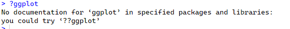

When you get errors, R is trying to help you.

# Why do errors happen?

From personal experience, being a TA for an R lab, and my time as the libraries Data Analysis and Visualization GAA, there are a few broad categories of errors:

1.  R does not understand what you are asking it for. This includes:

    -   The packages are not loaded

    -   R can't find the file or variable you are asking for

    -   Typos

    -   R is waiting for commands but not getting them. This include parentheses, quotes, and operations (like a plot) that are not closed.

2.  The data are not formatted properly. For example:

    -   You're working with a data frame when it has to be a matrix. Data frames can contain many different types of data but a matrix can only contain a single data type. See more detailed information [here.](https://www.geeksforgeeks.org/matrix-vs-dataframe-in-r/)

    -   A variable is numeric but it needs to be a factor.

    -   There as NA or 0 values in your data and what you are trying to do can't deal with that.

3.  Your code is in the wrong order or you already ran something that can't be run again on your existing data. This is usually the issue is someone says "this worked before".

4.  Other problems. These are harder to solve and are the more expert-level things. This can include having to use different versions of R or R packages, laying many functions together, only running parts of the data at a time to not crash a system, etc. If you encounter these types of errors, you are usually pretty advanced in R anyway. I rarely see these type of errors when I am helping others.

We are going to go over the errors listed above with examples now and how to fix them.

# 1. R does not understand what you are asking it for

### Example of working through errors dues to data availability and formatting

``` r
#Let's say we want to calculate the mean length of seagrass leaves that we measured in a seagrass medow

mean(seagrass$width)
```


R is saying, I don't know what seagrass is. I can't calculate the mean of something that does not exist in the R environment. This is why reading in all the files you need at the start of your script and checking that they look okay is one of the first [things you do in your RScript](https://ubc-library-rc.github.io/Beginner_R_Part1/content/about_R.html).

``` r
# make the seagrass dataframe 
  # step 1 make the variables
width = c("1.5", "2", "0.9", "1.8")
length = c("20", "18", "23", "19")
  # step 2 make the seagrass dataframe
seagrass = data.frame(width, length)
```

Now that we have the seagrass dataset in the R environment, let's try to calculate the mean again.

``` r
# try to calculate the mean again
mean(seagrass$width)
```


Still not working!

R is saying, I know you want me to calculate the mean, but width is a character variable. I can't calculate the mean of a character.

Let's look at the dataset a bit closer. If you look at the column types (press the blue button next to the word seagrass in the Data section of the environment), you can see that width has **chr** next to it, which means that width is a character. Since there is this sample problem with length as well, let's change the entire dataframe to numeric.

``` r
# lets make a new seagrass dataset, specifying the column types.
# this OVERWRITES the width, length, and seagrass objects we made previously
  # step 1 make the variables
width = as.numeric(c("1.5", "2", "0.9", "1.8"))
length = as.numeric(c("20", "18", "23", "19"))
  # step 2 make the seagrass dataframe
seagrass = data.frame(width, length)

# try to calculate the mean again
mean(seagrass$width)
```

The mean width is 1.55 cm

### Debreif about errors 

See how we got a bunch of errors but they kept changing and we worked through them?

As long as you are getting new errors, you are probably making progress. The issues arise when you get an error many times and as far as you can tell, the code should work.

When this happens:

-   Check your spelling

-   Save your RScript and re-start your R session. Run your script from the start again to see if it works. Sometimes this fixes the problem. Starting from an empty R environment can be very helpful in-case you overwrote something you did not mean to.

    Also, if you run and R Script from that start, you will find the first instance of an error in your script. This is very helpful to figure out where things start to break down.

### Quick package errors overview.

We do not really have time to cover packages today (see [Beginner R Part 1](https://ubc-library-rc.github.io/Beginner_R_Part1/)), but to help you in-case the error you are getting is because of a package that is not installed or loaded, here are the general steps

1.  type ?the.command (for example `?ggplot`) in your console. If you see this type of error message, it means the package that contains this command is not loaded.

    

    Use the library() command (for example `library(ggplot2)` ) to load the package that contains the command you need to run.

2.  If you **do not get errors** when you run the library command, try running your code again. You still might get errors, but they should be different now and they are probably because of data formatting or syntax of your code now.

    If you **get an error again**, go to step 3.

3.  see if the package that contains the function you need comes up when you [search for it in your installed packages](https://ubc-library-rc.github.io/Beginner_R_Part1/content/about_R.html#set-up-part-1-load-in-packages)

4.  if it does not come up, install the package. Go to step 2 after installing.

Errors because of packages not being available are common and is why we [load the packages at the start of our script](https://ubc-library-rc.github.io/Beginner_R_Part1/content/about_R.html#set-up-part-1-load-in-packages). That way, we can see the errors right away and deal with them before adding on complexity.

### R is waiting for a command but not getting it

If you notice that your console has **+** and not a **\>** next to the output (image below), that means R is still waiting for part of something to be run. This can cause many problems.


When this inevitably happens, click in the **console** and press the escape (*Esc*) key. Then. to check that it worked, click the *Enter* key. You should now see **\>** in your console again next to your newest lines.

This happens because a parentheses or quotes were not closed. For example, this means, you need to have the same number of `(` and `)` in your script, otherwise, you will have open parentheses. Same for quotes.

R will underline mismatched parentheses and they are color coated, so it should be possible to tell which one is missing.

# 2. The data are not formatted properly

Remember how we had to change a matrix to a dataframe in the example in part 1 above? That fall in this category. When running a statistical test, it is usually in the information about the package how the data need to be formatted.

*Note, we are not discussing the adonis function here, just exploring the help CRAN offers for each function that is a packages on CRAN.*

Let's look at a [function](https://rdrr.io/rforge/vegan/man/adonis.html) in the package vegan. This is for multivariate analysis of microbiome data.


This information is important to look over when using a new function. Most packages also have examples and example data that you can use to test the function on your computer before using your own data.

This is a screenshot of part of the *adonis* example on [CRAN](https://rdrr.io/rforge/vegan/man/adonis.html).

Note, if you want to run this, you need to run `install.packages("vegan")` followed by `library(vegan)` .


Running the examples with the example data is great because it lets you know that the package works as it should.

Then, you can modify the code to be the model type you want to run. If that still works, then your code is working. If it doesn't work, there is a problem with your code.

Then, when you run the same code with your own data, if it works, then great! Otherwise, you know the errors are because of data formatting, not because your code is wrong.

For every function in R, you can run the `?` function (so here it would be `?adonis`) to get a basic help overview in the **Help** tab in RStudio.

# 3. Code is in the wrong order

These types of errors are usually caused by [not setting up your R session correctly](https://ubc-library-rc.github.io/Beginner_R_Part1/content/about_R.html) before doing data analysis. This is often associated with troubleshooting code, where bunch of packages and new files get created, so the code works, but after starting a new R session, those seemingly unimportant pieces or parts of code that are in the wrong order cause problems.

**If your code works, then you go back to it and get an error, this is probably the type of error you are encountering.**

To mitigate this for myself, I

1.  Keep the URLs where I found the answers in a comment line right next to the code that was causing me issues and

2.  Check for "code is in the wrong order" errors after fixing something that took me a long time.

For step 2, I save and close R, then re-run the script I just fixed in a new R session. If the code still works, then all good!. If the code does not work, then the **troubleshooting is fresh in your mind** and it will be much easier to figure out what part of the code is in the wrong spot than if you went back and got the same error even the next day.

### 
