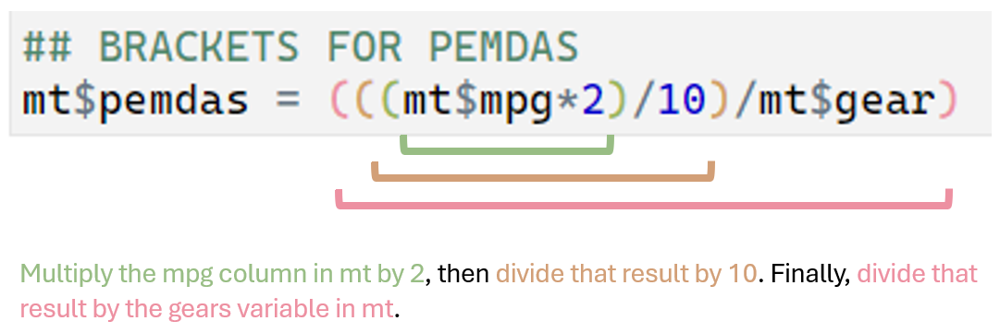

### What are operators?

Operators are symbols to tell R to perform certain mathematical operations. Think back to math class, we use `+` to indicate adding and `-` to indicate subtraction. R uses these operators and many others as well.

While `+` and `-` are simple operators, functions, which are part of packages in R, are basically *very fancy* operators. We talked a bit about packages in Beginner R Part 1. In this workshop, we assume you know what packages are, but we don't practice using them today.

### Guided Practice using operators

##### Organize our R script

In part 1 we talked about how the first step when making a new R script is to load packages we need fo our analysis. Since we will not be using packages that need to be loaded in with the `library()` command today, we can skip this step.

Then, in part 1, we talked about tell R where to get the data files from your computer. Today, we are only using data sets that are already part of R, so we can just ask R for the data and R will know to look within itself to find it.

``` r
# Tell R we want the mtcars dataset today and we want to call it mt
mt = mtcars
```

##### Try out some mathmatical operators

Now that we have our data and since this is a workshop I can tell you that it is formatted correctly, we can move to the fun part, data analysis!

``` r
## ADDITION 
mt$mpg+mt$cyl
```

Note that R is working along each row when you are using operators.


Because R is working along rows, you can create new variables in your dataset when doing calculations.

``` r
# Add variables together but when doing this, create a new variable in the mt dataset
mt$add = mt$mpg+mt$cyl
# get our new variable (add) to be printed in the console. 
print(mt$add)
#See how this is the same output as when we just ran this line mt$mpg+mt$cyl ?

## DIVISION
mt$div = mt$mpg/mt$cyl

## MULTIPLICATION
mt$mult = mt$mpg*mt$cyl

## BRACKETS TO SPECIFY THE ORDER OF OPERATIONS
# In English, PEMDAS is the acronym some people use to remember the order to calculate equations
  #1 Paretheses () 
  #2 Exponent ^ 
  #3 Multiplecation * and Division / in the order the are writen 
  #4 Addition + and Substraction - 
mt$pemdas = (((mt$mpg*2)/10)/mt$gear)
```



The point here is not to re-hash math lessons, but to revisit why the order that we write things in is important. We all read English the same way, left to right, top to bottom. R does the same thing with the code you give it. PEMDAS is hopefully a familiar example to illustrate this point with non-English text.

##### Other math operatiors

Sometimes you want to learn about your data, but not manipulate it. R has operators for this as well. These include:

`min()` find the minimum value in the column

`max()` find the maximal value in the column

`sum()` find the sum of the column

`mean()` find the mean of the column

`length()` count the number of rows in the column

``` r
## Find the mean cyl
mean(mt$cyl)
```

The mean is 6.1875

##### Subset our data using other operators

Let's say we only want part of the entire dataset we have. This is achieved with the `subset()` command. Here are a list of operators you might use:

`==` equal to

`!=` not equal to

`>` greater than (only works with numeric or integer variables)

`>=` greater or equal to (only works with numeric or integer variables)

`<` less than (only works with numeric or integer variables)

`<=` less than or equal to(only works with numeric or integer variables)

`&` and

`|` or

``` r
# Create a new dataframe with only cars that have at least 5 cyclinders
mtsub = subset(mt, mt$cyl>= 5)

# Create new dataframe with cars that have a wt below 2 or over 5
mtextreme = subset(mt, mt$wt<2 | mt$wt >5)
```

### Solo practice using operators

##### Exercise #1

Create a new dataframe called *mtmid* by **subsetting** *mt*. You should only keep the data that match the following criteria:

1.  Have 4 cyl
2.  qsec should be over 18
3.  Does not have 3 gears

Your resulting data should have 8 cars left:

"Datsun 710" "Merc 240D" "Merc 230" "Fiat 128" "Honda Civic" "Toyota Corolla" "Fiat X1-9" "Volvo 142E"

If you got this answer, great! Move on to Exercise #2

##### Exercise #2

Create a new variable in *mtmid* called *ex2*. Create this new variable by **dividing** the mpg by cyl and put that the the **power** of the carb.

Go to Exercise #3

##### Exercise #3

Find the maximal value of your new *ex2* variable

##### Answers for Exercise #1 to 3

``` r
# Exercise #1
mtmid = subset(mt, mt$cyl==4 & mt$qsec >18 & mt$gear !=3)


# Exercise #2
mtmid$ex2 = (mtmid$mpg/mtmid$cyl)^mtmid$carb


# Exercise #3
max(mtmid$ex2)
```
