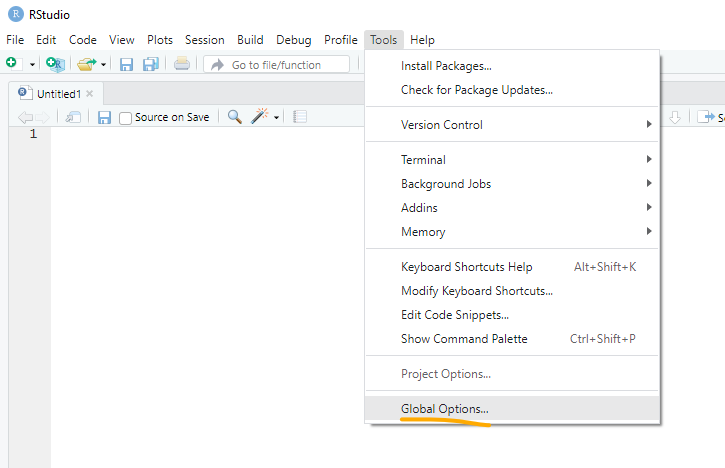

# Customization and Citations 

We covered a lot of material today! This extra content page goes over how to make RStudio look how you want it to and how to save time citing R packages.

## Customization

RStudio is highly customizable in appearance.

If you want to make a quick change to the Zoom of your RStudio, you can hold down CTRL (PC) or CMD (Mac) and press + or - until you have the Zoom level you want.

To change parameters and RStudio appearance that will be set to your new default for every R session, go to *Tools\>Global Options*

For all changes you make in Global Options, if you click *OK*, it saves the changes and closes the Global Options pop up. If you click *Apply*, if saves the changes but keeps Global Options open.

To change font and colors, go to *Appearance*

To change where the parts of RStudio are, go to *Pane Layout*

## Citing Packages

RStudio has a built in `citation()` command that let's you easily cite the packages you currently have loaded in R. This is best done from the console.

You type the package name with quotes around it, and the citation will output.

The part of the output that is highlighted in grey can be copy-pasted and important automatically in many citation software including Zotero. See the UBC Libraries [Citation Management](https://guides.library.ubc.ca/citationmanagement) guide for help with citation software.

The package version is rarely in the citation. You can manually find it in your packages pane.

