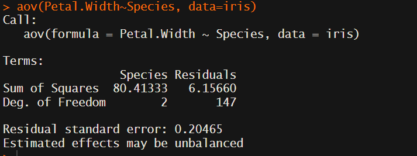
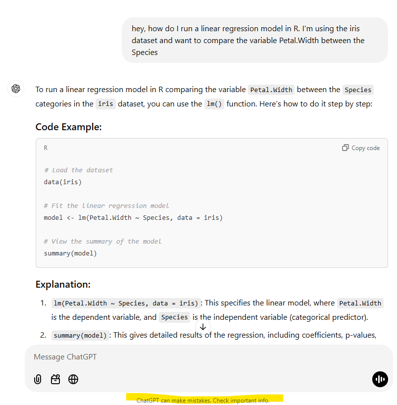
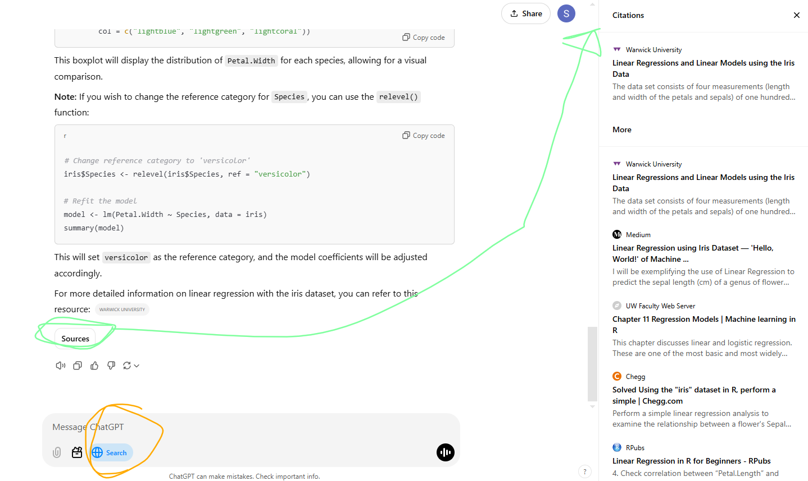

# Here are some practice problems 

## Subset data
P1. Subset the built in `iris` dataset to only keep the *setosa* species. Call this subset *set.iris*

<strong> Answer P1</strong>

set.iris = subset(iris, iris$Species=="setosa")

P2. Subset the built in `iris` dataset to only keep the *setosoa* species and only keep individuals with a *Petal.Length* over 1.5. Call this subset *set.iris.long*

<strong> Answer P2</strong>

set.iris.long = subset(iris, iris$Species=="setosa" & iris$Petal.Length>1.5)

## Use online resources
Learning how to use online resources is the skill that will allow you to code independently. Even if you never memorize any code, you will be able to do what you want, because the internet has already “memorized” the code for you. 
Tip, I usually look for examples on the documentation I'm looking at, since this shows you what code that you are going to run looks like. Information sheets and tutorials often have related, but not immediately relevant information that can get confusing. 
### R documentation
These documents are created by the developpers. They are th emost accurate and detailed options avaialble to you. 
#### Built in R documentation (help)
P3. Use the command `?cor` to pull up the R documentation to run a correlation test. Correlate `Petal.Length` and `Petal.Width` in the `iris` dataset.

<strong> Answer P3</strong>

cor(iris$Petal.Length, iris$Petal.Width)

#### Online R doumentation
P4. Go to <a href="https://www.rdocumentation.org/packages/stats/versions/3.6.2/topics/cor" target="_blank">this website</a> that I found through Google with the search query *cor R*. Compare the information from the `?cor` information you got in R. What do you notice?

### Google
P5. o a Google search to for how to run a correlation test in R. I've listed my search query and some websites that I would reccomend from my search result in the answer.

<strong> Answer P5</strong>

run correlation test in R

STHDA https://www.sthda.com/english/wiki/correlation-test-between-two-variables-in-r 

Data Camp https://www.datacamp.com/doc/r/correlations

There are other websites that have good information as well, especially for more niche analyses, but STHDA and Data Camp are generally reliable. 

P6. Run an ANOVA in R. Use a Google search to figure out how to do this. Compare the mean *Petal.Width* between the three *Species* in the *iris* dataset. My code and output are in the answer section. If you get differnt code that's okay, the important thing is getting the same numeric output. 

<strong> Answer P6</strong>

aov(Petal.Width~Species, data=iris)

P7. You'll notice that the ANOVA output from 2 is not very useful. Sometimes, you need to use an additional function `summary()` to see the summary of the statistics. Try to figure out how to do this, answer below.

<strong> Answer P7</strong>

a1=aov(Petal.Width~Species, data=iris)

summary(a1)

   
### ChatGPT
P8. Ask ChatGPT for help running a linear regression model comparing *Petal.Width* between the three *Species* in the *iris* dataset. 

<strong> Answer P8</strong>

Note, being able to use AI tools will be as important as email and microsoft office tools like Word (arguably already is) in the workplace. This is often the most efficient route to getting a framework for code. You can ask for very specific things, which make the answer customized to your data. However, there is a major issue, the AI does not know if the answer is correct. You can check by looking at the documentation for the function it suggests yourself (the first few exercises) and/or you can turn on web search (circled in orange), then click on sources (circled in green) at the bottom of the output. It will pull up relevant websites and then you can decide if you think those websites are trustworthy or not. 

